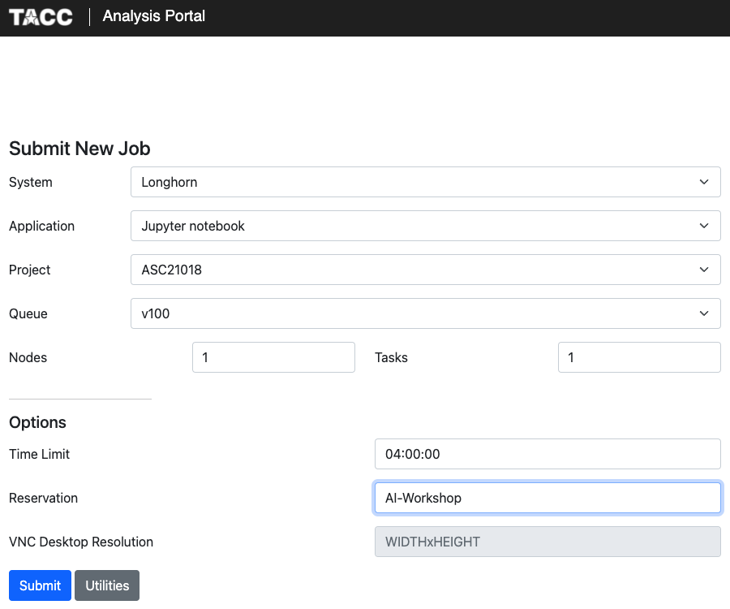
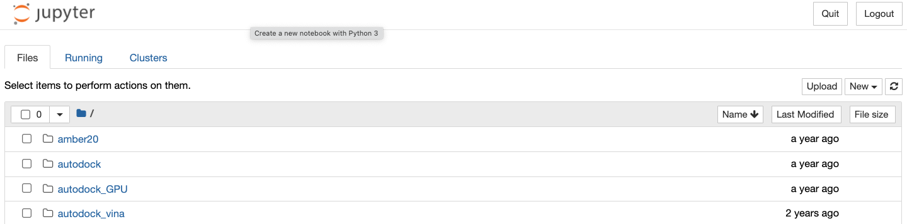
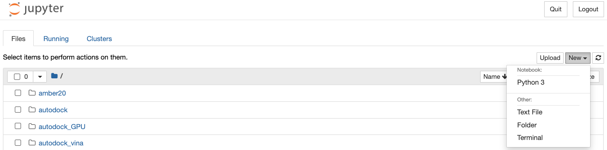
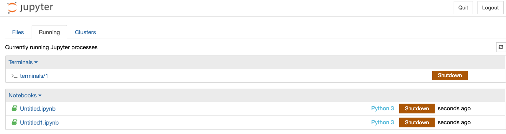
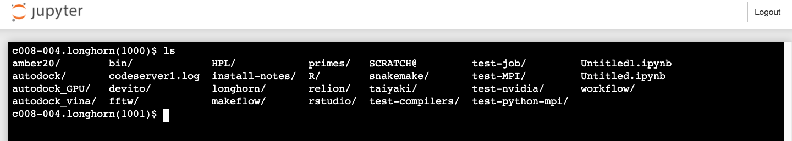
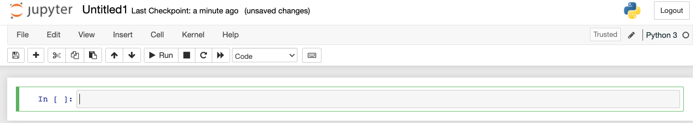
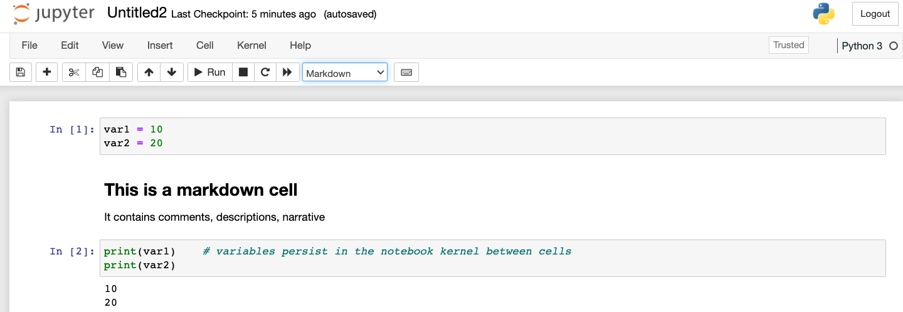

Jupyter Notebooks
=================

What are Jupyter Notebooks?
---------------------------

Jupyter Notebooks are a web-based, interactive computing tool for capturing the
whole computation process: developing, documenting, and executing code, as well
as communicating the results. They support interactive data science and scientific
computing across all programming languages, including Python.

How do Jupyter Notebooks Work?
------------------------------

An open notebook has exactly one interactive session connected to a kernel which
will execute code sent by the user and communicate back results. This kernel
remains active if the web browser window is closed, and reopening the same
notebook from the dashboard will reconnect the web application to the same kernel.
The kernel's state, including imported libraries and declared variables, persists
between cells.

How do You Access Jupyter Notebooks?
------------------------------------

1. The `Jupyter website <https://www.jupyter.org>`_ allows you to download Jupyter
   Notebook and/or try it in your browser.
2. The `TACC Analysis Portal <https://vis02.tacc.utexas.edu/>`_ allows TACC users to run Jupyter
   through your browser on Frontera, **Longhorn**, Maverick2, or Stampede2, so long
   as you have an allocation on that system.
3. The TACC `DesignSafe Portal <https://www.designsafe-ci.org>`_ allows anyone with
   a TACC account to use Jupyter. (Log in, choose Workspace => Tools and Applications => Jupyter)
4. TACC provides small, short lived Jupyter notebooks to anyone with a TACC account
   via the `TACC Cloud <https://jupyter.tacc.cloud/hub/login>`_.
5. Public Jupyter notebooks are available through sites like
   `Google Colaboratory <https://research.google.com/colaboratory/>`_.
6. Service exist to share notebooks in a browser including `Binder <https://mybinder.org/>`_.

Interacting with Jupyter Notebooks
----------------------------------

First, choose one of the methods above and start a new Jupyter Notebook. I will
be following method #2 - the TACC Analysis Portal. For this workshop, use the
following settings:

|
The original, and more common "tree" interface to Jupyter will display a file
browser (in this case to files in your Longhorn /home directory):

|
New Python3 kernels and Terminals can be launched by clicking the "New" button
on the right side:

|
Running kernels can be accessed through the "Running" tab on the top. By default,
the Jupyter Notebooks will be saved in your /home directory with a ``.ipynb``
extension. (Re-opening the notebook will open all the cells, and restore the state
of the kernel - more on this later):

|
The terminal is a standard, fully-functional terminal. Very useful for debugging
and interacting with files / directories. For example, you can easily ``wget`` a
data set or unzip a file:

|
The Jupyter notebook consists of a toolbar (top) and an unlimited number of
cells (bottom):

|
Cells can be either "code cells" or "markdown cells". Code cells allow you to
enter and run code. Markdown cells use the markdown markup language to comment on
or narrate what is happening in the notebook:

|

Miscellaneous Tips and Tricks
-----------------------------

Shortcuts:

* Shift+Enter: run cell
* Ctrl+Enter: run cell in place
* Alt+Enter: run cell, insert below
* Esc / Enter: toggle between command and edit mode

Run a command within a Jupyter notebook (prefix with ``!``):

.. code-block:: console

   In[]: ! pip list
   In[]: ! pip install --user names

The file browser is not (by default) aware of your /work or /scratch directories
on Longhorn. The easiest thing to do is open up a terminal and make symbolic
links to your /work and /scratch directories in your /home directory

.. code-block:: console

   [longhorn]$ cd
   [longhorn]$ pwd
   /home/03439/wallen
   [longhorn]$ ln -s /work/03439/wallen/ WORK
   [longhorn]$ ln -s /scratch/03439/wallen/ SCRATCH

Exercise
--------

Make a copy of a previously-prepared demo notebook in your /home directory. Open
the notebook with Jupyter. Execute the cells within and think about why it is
organized the way it is. To copy the notebook:

.. code-block:: console

   [longhorn]$ cd     # cd to /home directory
   [longhorn]$ cp /scratch/03439/wallen/AI-Drug-Discovery/notebook_demo.ipynb .

Once you run each cell, save the notebook with a new name. Re-open the original
notebook as well as the new notebook. Does saving the notebook save the state of
the kernel as well?
