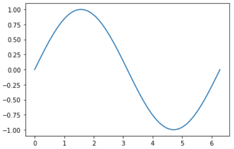
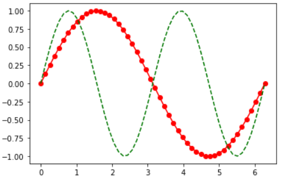

NumPy, SciPy, and Matplotlib Primer
===================================

NumPy, SciPy, and Matplotlib are three complementary and important Python
libraries that are useful for exploratory data analysis and machine learning.
This primer is a high-level introduction to each library, providing short
examples for each.

NumPy
-----

**NumPy** provides a multidimensional array object for very fast operations on
numerical data (e.g. arithmetic, logical, sorting, selecting, transforming,
statistical, etc.).

Much faster than doing similar operations with normal Python data types because
it uses pre-complied, vectorized C code behind the scenes.

.. code-block:: python3
   :linenos:

   import numpy as np

   a = np.arange(15).reshape(3, 5)

   print(a)
   print(a.shape)
   print(a.ndim)

.. code-block:: bash

   ### Output:

   [[ 0,  1,  2,  3,  4],
    [ 5,  6,  7,  8,  9],
    [10, 11, 12, 13, 14]]
   (3, 5)
   2

A few very easy array operation examples:

.. code-block:: python3
   :linenos:

   import numpy as np

   a = np.arange(15).reshape(3, 5)

   print(a.max())
   print(a.min())
   print(a.sum())
   print(a*2)

.. code-block:: bash

   ### Output:

   14
   0
   105
   [[ 0  2  4  6  8]
    [10 12 14 16 18]
    [20 22 24 26 28]]

SciPy
-----

**SciPy** provides mathematical algorithms and convenience functions for working
with NumPy arrays.

It comes with a host of high level commands for different scientific computing
domains, including clustering, Fourier transforms, integration, interpolation,
linear algebra, signal processing, among others.

The following short code block defines a function to be integrated (called the
"integrand") as ``f(x) = ax^2 + b``. The SciPy ``quad`` function evaluates the
integral over a given range, in this case from 0 to 1. The output is a tuple
where the first item is the value of the integral, and the second item is the
estimated error.

.. code-block:: python3
   :linenos:

   from scipy.integrate import quad
   def integrand(x, a, b):
       return a*x**2 + b

   a = 2
   b = 1
   I = quad(integrand, 0, 1, args=(a,b))
   print(I)

.. code-block:: bash

   ### Output:

   (1.6666666666666667, 1.8503717077085944e-14)

Matplotlib
----------

**Matplotlib** provides utilities for creating static, animated, and interactive
visualizations of data.

You can use it to create many different types of plots (line, histogram, scatter,
countour, 3D, etc.) with full control over all labels, colors, styles, etc. Look
online for examples of the kind of plot you want to make, and undoubtedly there
will be some Matplotlib samples available.

.. code-block:: python3
   :linenos:

   import matplotlib.pyplot as plt
   import numpy as np

   x = np.linspace(0, 2*np.pi, 50)
   plt.plot(x, np.sin(x))
   plt.show()

.. code-block:: python3
   :linenos:

   import matplotlib.pyplot as plt
   import numpy as np

   x = np.linspace(0, 2*np.pi, 50)
   plt.plot(x, np.sin(x), 'r-o', x, np.sin(2*x), 'g--')
   plt.show()

.. code-block:: python3
   :linenos:

   # save the image to file instead
   plt.savefig('my_sinwave.png')

Additional Resources
--------------------

* `NumPy Docs <https://numpy.org/doc/stable/>`_
* `SciPy Docs <https://scipy.github.io/devdocs/index.html>`_
* `Matplotlib Docs <https://matplotlib.org/stable/users/index>`_
