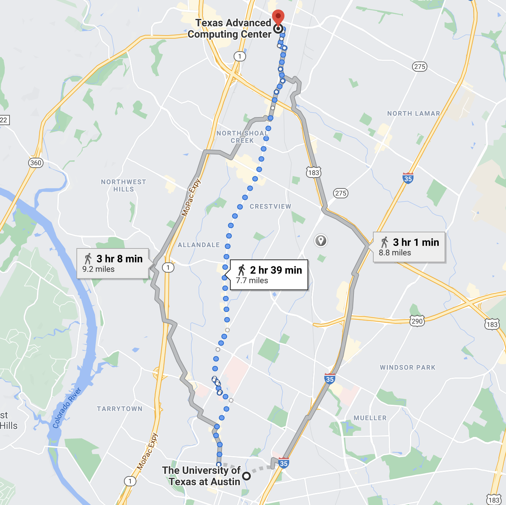
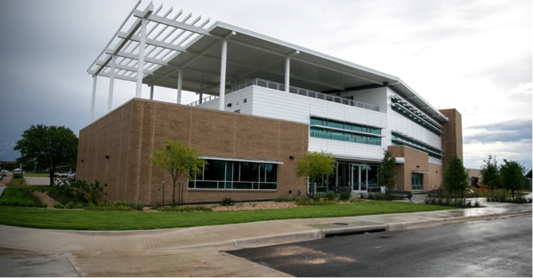
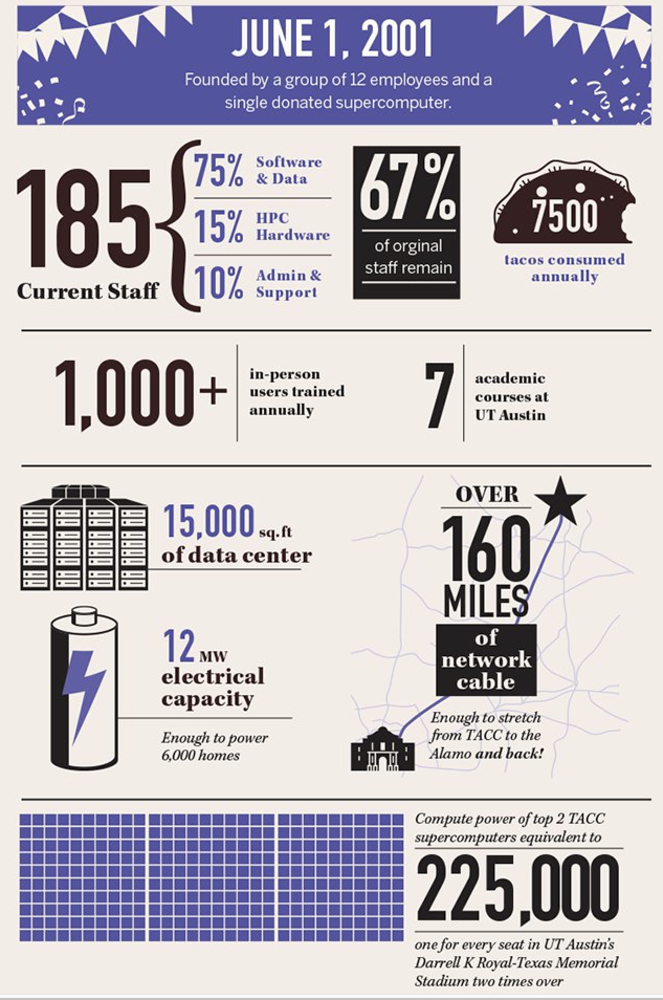
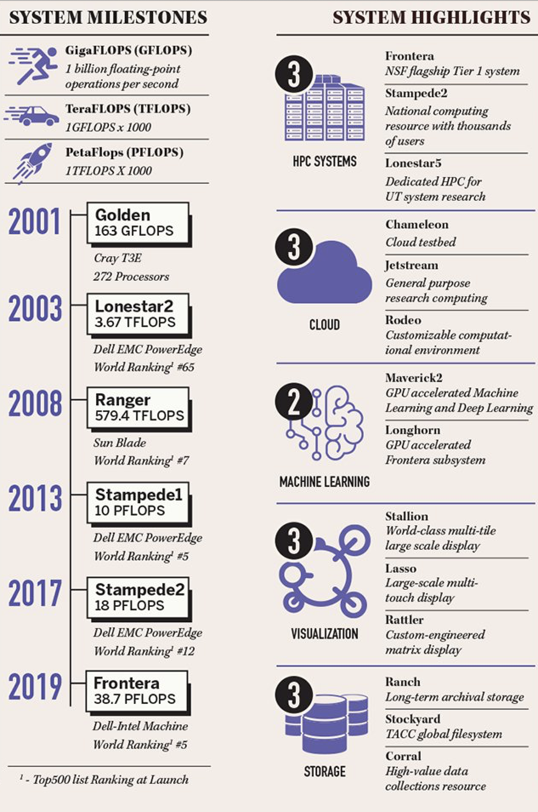
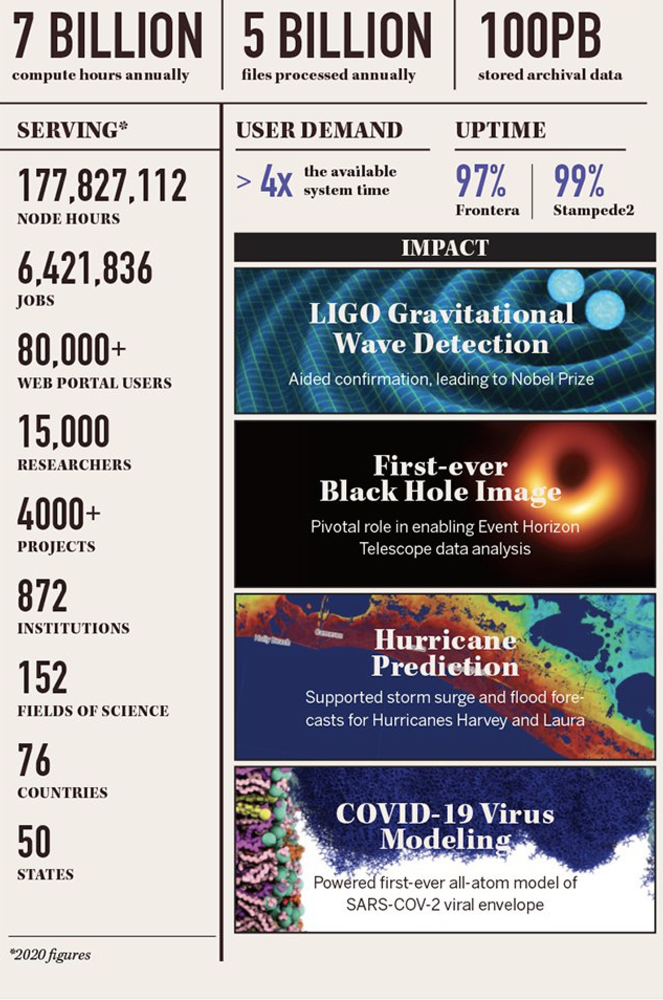
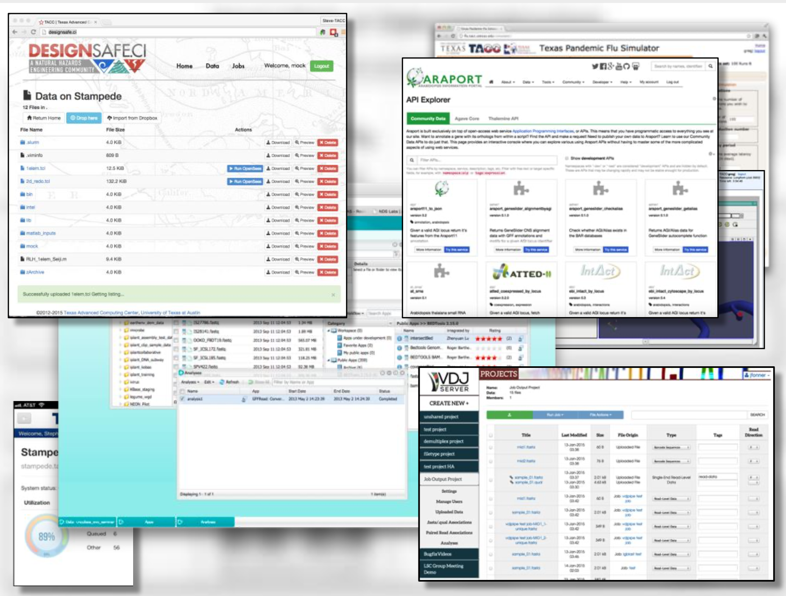
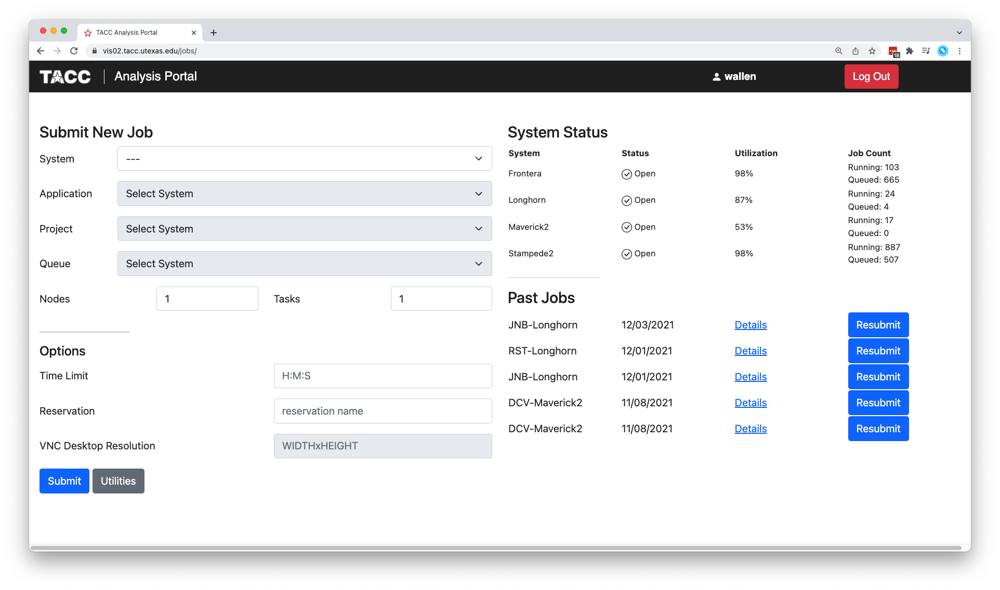

Onboarding to TACC
==================

The Texas Advanced Computing Center (TACC) at UT Austin designs and operates
some of the world's most powerful computing resources. The center's mission is
to enable discoveries that advance science and society through the application
of advanced computing technologies.

We will be using cloud resources at TACC as our development environment. We will
access the cloud resources via our SSH clients and TACC account credentials, as
well as through a visualization portal.

.. attention::

   Everyone please apply for a TACC account now using
   `this link <https://portal.tacc.utexas.edu/web/tup/account-request>`_. If you
   already have a TACC account, you can just use that. Send your TACC username
   to wallen [at] tacc [dot] utexas [dot] edu as soon as possible.

About TACC
----------

TACC is a Research Center, part of UT Austin, and located at the JJ Pickle
Research Campus.

    A short 7.7 mile walk from main campus!

    One of two TACC buildings located at JJ Pickle.

.. figure:: images/frontera_racks.png
    :width: 400px
    :align: center

    A tall guy standing among taller Frontera racks.

**TACC at a Glance**

**Other TACC Services**

* Portals and gateways
* Web service APIs
* Rich software stacks
* Consulting
* Curation and analysis
* Code optimization
* Training and outreach
* => `Learn more <https://www.tacc.utexas.edu/>`_

    Snapshot of a few of TACC's portal projects.

**TACC Partnerships**

* NSF: Leadership Class Computing Facility (LCCF)
* NSF: Extreme Science and Engineering Discovery Environment (XSEDE)
* UT Research Cyberinfrastructure (UTRC)
* TX Lonestar Education and Research Network (LEARN)
* Industry, `STAR Program <https://www.tacc.utexas.edu/partnerships/star/partners>`_
* International, The International Collaboratory for Emerging Technologies
* => `Learn more <https://www.tacc.utexas.edu/>`_

.. attention::

   Did you already e-mail me your TACC username?

Before We Continue
------------------

Using your SSH client, please try to log in to Longhorn:

.. code-block:: console
   :emphasize-lines: 1,7,8,50

   [local]$ ssh wallen@longhorn.tacc.utexas.edu
   To access the system:

   1) If not using ssh-keys, please enter your TACC password at the password prompt
   2) At the TACC Token prompt, enter your 6-digit code followed by <return>.

   Password:
   TACC Token Code:
   Last login: Mon Dec  6 15:36:46 2021 from 192.168.64.11
   ------------------------------------------------------------------------------
                      Welcome to the Longhorn Supercomputer
         Texas Advanced Computing Center, The University of Texas at Austin
   ------------------------------------------------------------------------------

                 ** Unauthorized use/access is prohibited. **

   If you log on to this computer system, you acknowledge your awareness
   of and concurrence with the UT Austin Acceptable Use Policy. The
   University will prosecute violators to the full extent of the law.

   TACC Usage Policies:
   http://www.tacc.utexas.edu/user-services/usage-policies/
   ______________________________________________________________________________

   Welcome to Longhorn, *please* read these important system notes:

   --> Longhorn user documentation is available at:
          https://portal.tacc.utexas.edu/user-guides/longhorn

    |\                                                               /|
    | \___________________________.-----.___________________________/ |
    '.__________________________           __________________________.'
        _                     <_/|       |\_>
       | |     ___  __  _  ___    |     |   _   _  ___  ____  __  _
       | |    / _ \|  \| |/ __)    |   |   | |_| |/ _ \| .. \|  \| |
       | |___| (_) | \ \ | (_--   (     )  |  _  | (_) | '' /| \ \ |
       |_____|\___/|_|\__|\___/    '---'   |_| |_|\___/|_|\_\|_|\__|

   ---------------------- Project balances for user wallen -----------------------
   | Name           Avail SUs     Expires | Name           Avail SUs     Expires |
   | ASC21018           12000  2022-06-30 | SD2E-Communit       5548  2021-12-31 |
   | TACC-SCI          221130  2025-06-30 | TRA21002            2040  2021-12-31 |
   ------------------------- Disk quotas for user wallen -------------------------
   | Disk         Usage (GB)     Limit    %Used   File Usage       Limit   %Used |
   | /work             436.5    1024.0    42.63      1445104     3000000   48.17 |
   | /home              28.1      40.0    70.26       192235      512000   37.55 |
   | /scratch          571.3       0.0     0.00     10273017           0    0.00 |
   -------------------------------------------------------------------------------

   login2.longhorn(1000)$       # success!

Also, please try to log in to this Vis Portal using your TACC username and password:

https://vis02.tacc.utexas.edu/

    Successful login.
